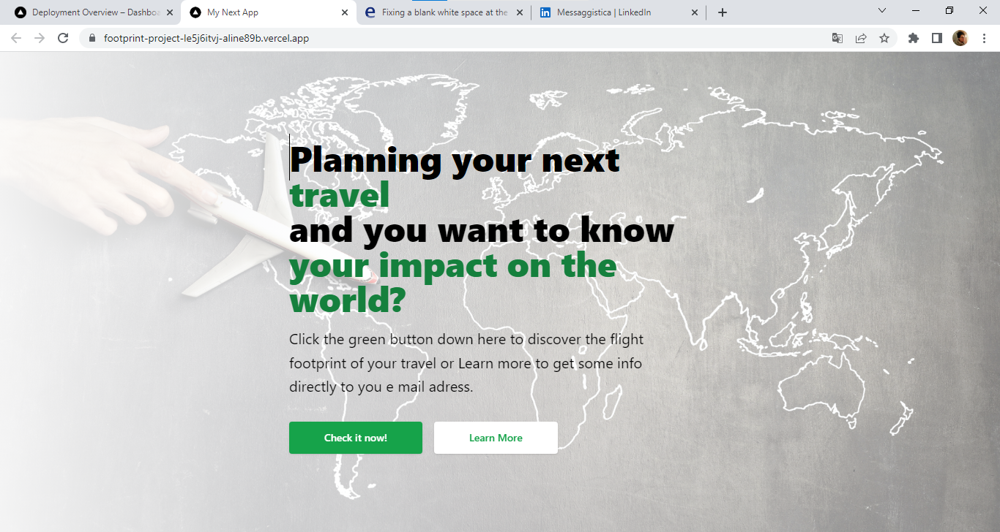

This is a [Next.js](https://nextjs.org/) project bootstrapped with [`create-next-app`](https://github.com/vercel/next.js/tree/canary/packages/create-next-app).

## Getting Started

First, run the development server:

```bash
npm run dev
# or
yarn dev
```

Open [http://localhost:3000](http://localhost:3000) with your browser to see the result.

You can start editing the page by modifying `pages/index.js`. The page auto-updates as you edit the file.

[API routes](https://nextjs.org/docs/api-routes/introduction) can be accessed on [http://localhost:3000/api/hello](http://localhost:3000/api/hello). This endpoint can be edited in `pages/api/hello.js`.

The `pages/api` directory is mapped to `/api/*`. Files in this directory are treated as [API routes](https://nextjs.org/docs/api-routes/introduction) instead of React pages.

# Calculate the footprint of your flight travel - Nexyjs project


## About The Project



This is my last project for s2i platform. Here I've used Nextjs framework creating a small app for calculating the footprint of a travel by plane.
It is possible so looking for arrival and departure city/country/airport and choosing the number of passengers.
You will see the result for passenger and for the total of passengers from [Climatiq Api](https://www.climatiq.io/). 
It is possible to submit name surname and e mail to the form and it will be saved in MONGODB.


## Using Footprint App

To use the Footprint App, follow these steps:

```
press inside the search bar
start typing the name of airport or country of departure
start typing the name of airport or country of arrival
chose the number of passengers
press GO button
```
You can find the app deployed on github pages at the address https://footprint-project.vercel.app/.

### Built With


## Getting Started

This is an example of how you may give instructions on setting up your project locally.
To get a local copy up and running follow these simple example steps.

### Prerequisites

This is an example of how to list things you need to use the software and how to install them.
* npm
  ```sh
  npm install npm@latest -g
  ```

### Installation

1. Get a free API Key at [https://www.climatiq.io/docs](https://www.climatiq.io/docs)
2. Clone the repo
   ```sh
   git clone https://github.com/Aline89b/footprint-project.git
   ```
3. Install NPM packages
   ```sh
   npm install
   ```
4. Enter your API in `.env.local`
   ```js
    API_KEY = 'ENTER YOUR API';
   ```

## Contributing

Contributions are what make the open source community such an amazing place to learn, inspire, and create. Any contributions you make are **greatly appreciated**.

If you have a suggestion that would make this better, please fork the repo and create a pull request. You can also simply open an issue with the tag "enhancement".
Don't forget to give the project a star! Thanks again!

1. Fork the Project
2. Create your Feature Branch (`git checkout -b feature/AmazingFeature`)
3. Commit your Changes (`git commit -m 'Add some AmazingFeature'`)
4. Push to the Branch (`git push origin feature/AmazingFeature`)
5. Open a Pull Request

## Contact

If you want to contact me you can reach me at <a.grianti89@gmail.com>.